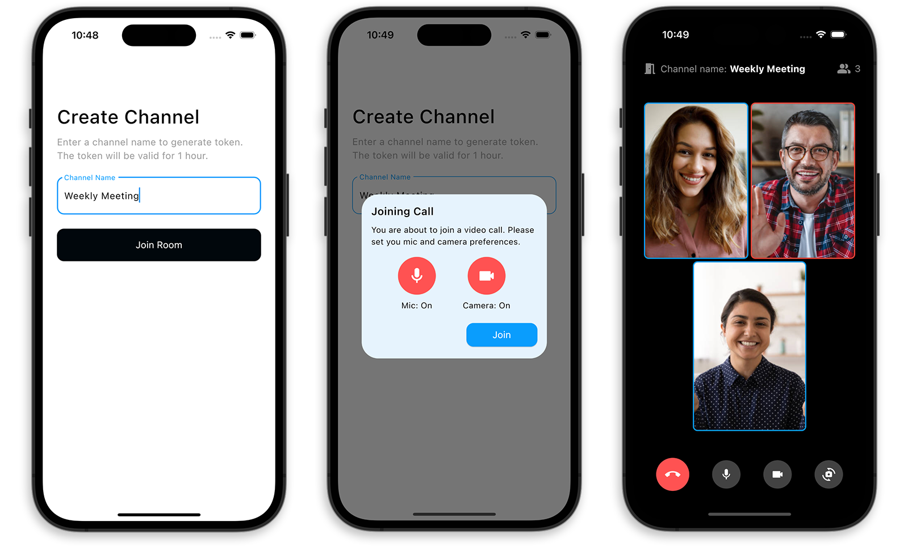

# Flutter Agora Demo App

A [Flutter](https://flutter.dev) app for demonstrating [Agora](https://www.agora.io) integration to support realtime video calling experience that works on Android, iOS, and Web platforms.

## Pages

The app will consist of two primary pages:

* **Create Channel Page:** This page will serve as the starting point for users to initiate a video call. They will be able to enter a channel name, which will be used to create a unique video call room. Users will also get a dialog for selecting their preference for microphone and camera on/off before joining the call. By clicking the "Join" button, users will be directed to the Video Call Page, where they'll be able to participate in the video call with other users who have joined the same channel.

* **Video Call Page:** This is where the actual video calling experience takes place. Users who have joined the same channel will be able to see and hear each other in real-time. On this page, they will have access to essential call actions such as muting or un-muting audio, switching between front and rear cameras, and leaving the channel to return to the Create Channel Page.

## Cloud Function

There's one Firebase Cloud Function used in this project for generating the Agora Token which is required for authenticating each user. The function is located in the [`functions`](/functions/index.js) directory.

## Packages used

- [firebase_core](https://pub.dev/packages/firebase_core)
- [cloud_functions](https://pub.dev/packages/cloud_functions)
- [agora_rtc_engine](https://pub.dev/packages/agora_rtc_engine/versions/5.3.1)
- [permission_handler](https://pub.dev/packages/permission_handler)
- [flutter_dotenv](https://pub.dev/packages/flutter_dotenv)

## License

Copyright (c) 2023 Souvik Biswas

Permission is hereby granted, free of charge, to any person obtaining a copy
of this software and associated documentation files (the "Software"), to deal
in the Software without restriction, including without limitation the rights
to use, copy, modify, merge, publish, distribute, sublicense, and/or sell
copies of the Software, and to permit persons to whom the Software is
furnished to do so, subject to the following conditions:

The above copyright notice and this permission notice shall be included in all
copies or substantial portions of the Software.

THE SOFTWARE IS PROVIDED "AS IS", WITHOUT WARRANTY OF ANY KIND, EXPRESS OR
IMPLIED, INCLUDING BUT NOT LIMITED TO THE WARRANTIES OF MERCHANTABILITY,
FITNESS FOR A PARTICULAR PURPOSE AND NONINFRINGEMENT. IN NO EVENT SHALL THE
AUTHORS OR COPYRIGHT HOLDERS BE LIABLE FOR ANY CLAIM, DAMAGES OR OTHER
LIABILITY, WHETHER IN AN ACTION OF CONTRACT, TORT OR OTHERWISE, ARISING FROM,
OUT OF OR IN CONNECTION WITH THE SOFTWARE OR THE USE OR OTHER DEALINGS IN THE
SOFTWARE.
